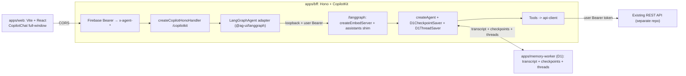

# LangChain + LangGraph Agent Runtime Boilerplate

A **Turborepo** boilerplate for a full-window AI chatbot: a **Vite + React**
frontend, a **BFF** built with **Hono** + the **CopilotKit runtime**, and
**LangGraph** agents served through an **embedded LangGraph platform app**
(`createEmbedServer`) with **D1 checkpoints** — no separate agent server.

Business data lives in your existing REST API (separate repo), which agent
tools call through a typed client.

- `apps/web` — Vite + React product frontend: optional Google sign-in
  (Firebase client) and a full-window CopilotKit chat that calls the BFF
  directly from the browser (no proxy layer).
- `apps/bff` — Hono service mounting `createCopilotHonoHandler`
  (`/copilotkit`), transcript history (`GET /memory/*`), and `GET /health`.
- `apps/agent` — LangGraph graphs + tools + CopilotRuntime factory. Graphs
  run in-process inside the BFF; optional `pnpm studio` for LangGraph Studio.
- `apps/memory-worker` — Cloudflare Worker owning durable transcript state
  and LangGraph engine checkpoints in D1.
- `apps/realtime-worker` — Cloudflare Worker + Durable Objects for
  cross-session thread/message sync (`GET /ws`, `POST /publish`).
- `packages/*` — shared config, types, constants, and prompt builders.

## Architecture



The BFF verifies Firebase ID tokens, injects sanitized `x-agent-*` headers,
and serves the graph through the embedded LangGraph platform routes
(`/langgraph`, experimental `createEmbedServer` pinned by version); the
CopilotKit runtime reaches them with stock `LangGraphAgent` adapters over
loopback, re-presenting the caller's token. Tools call the existing REST API
with the user's Bearer token — identity always comes from that trusted
context, never from model arguments. CopilotKit Intelligence is not used.

## Tech stack

| Area     | Choice                                                                    |
| -------- | ------------------------------------------------------------------------- |
| Monorepo | Turborepo + pnpm workspaces + TypeScript (strict)                         |
| Frontend | Vite, React 19, Tailwind CSS 4, CopilotKit v2 CopilotChat                 |
| BFF      | Node, Hono, CopilotKit runtime + embedded LangGraph platform app          |
| Agent    | LangChain, LangGraph, Zod                                                 |
| Identity | Firebase ID token (JWKS verify on BFF)                                    |
| Tooling  | Shared ESLint (flat) + tsconfig via `@repo/config`; Prettier at repo root |

## Getting started

Requirements: Node >= 20 and pnpm (`corepack enable`).

```bash
# 1. Install dependencies
pnpm install

# 2. Configure environment
cp apps/bff/.env.example apps/bff/.env
# set OPENAI_API_KEY; set MEMORY_WORKER_URL for D1 transcript + checkpoints;
# set API_BASE_URL so tools can call your REST API with the user Bearer token
cp apps/web/.env.example apps/web/.env
# set VITE_FIREBASE_* (same project as FIREBASE_PROJECT_ID in apps/bff/.env)

# 3. Run everything (web + bff + workers)
pnpm dev

# Or separately:
# pnpm dev:bff     # CopilotKit BFF on :4000 (runs graphs in-process)
# pnpm dev:web

# Recommended: durable transcript + checkpoints in local D1
pnpm --filter @repo/memory-worker dev

# Optional: cross-tab / cross-device thread sync
pnpm --filter @repo/realtime-worker dev

# Optional: LangGraph Studio
# pnpm --filter @repo/agent studio
```

- Web app: http://localhost:3000
- BFF API: http://localhost:4000 (`/health`, `/copilotkit`, `/memory`)
- Memory worker (recommended): http://localhost:8788 — set `MEMORY_WORKER_URL`
  in `apps/bff/.env`. Without it, transcript memory middleware no-ops and
  graph checkpoints fall back to in-process `MemorySaver`.
- Realtime worker (optional): http://localhost:8789 — set
  `REALTIME_WORKER_URL` + `REALTIME_PUBLISH_SECRET` in `apps/bff/.env` and
  `VITE_REALTIME_WS_URL=ws://localhost:8789/ws` in `apps/web/.env`.

Note: `/copilotkit` and `/memory` require a Firebase ID token
(`Authorization: Bearer`). Set `FIREBASE_PROJECT_ID` in `apps/bff/.env`
(same project as the web app).

### How the frontend connects

`apps/web` signs the user in with the Firebase client SDK and mounts
CopilotKit pointed directly at the BFF:

```tsx
<CopilotKit
  runtimeUrl="https://your-bff-host/copilotkit"
  agent="workspaceAgent"
>
  <CopilotChat agentId="workspaceAgent" />
</CopilotKit>
```

The BFF's `CORS_ORIGINS` must include the frontend origin (the default
`.env.example` allows `http://localhost:3000`). Firebase ID tokens expire
after about an hour — `apps/web` subscribes to `onIdTokenChanged` and rotates
the header via `copilotkit.setHeaders()`; see
[apps/web/README.md](apps/web/README.md).

### Useful scripts

```bash
pnpm dev            # run web + bff
pnpm dev:bff        # bff only
pnpm dev:web        # web only
pnpm dev:realtime   # realtime worker (Durable Objects) on :8789
pnpm typecheck      # type-check every package
pnpm lint           # lint every package
pnpm test           # run workspace regression tests
pnpm format         # format with Prettier
```

### Optional: realtime multi-tab sync

1. Copy `apps/realtime-worker/.dev.vars.sample` → `.dev.vars` and set
   `FIREBASE_PROJECT_ID` + `REALTIME_PUBLISH_SECRET`.
2. Set matching `REALTIME_WORKER_URL` + `REALTIME_PUBLISH_SECRET` in
   `apps/bff/.env`.
3. Set `VITE_REALTIME_WS_URL=ws://localhost:8789/ws` in `apps/web/.env`.
4. Run `pnpm dev:realtime` alongside `pnpm dev`.

The agent publishes events after durable memory writes; browsers connect with
the Firebase ID token and stay in sync across tabs/devices.

## Repository layout

```
apps/
  web/              Vite + React frontend (Firebase sign-in + full-window CopilotChat)
  bff/              Hono BFF: CopilotKit runtime + REST (/memory, /health)
  agent/            LangGraph graphs + in-process CopilotRuntime factory
  memory-worker/    Cloudflare Worker: D1 transcript ledger + engine checkpoints
  realtime-worker/  Cloudflare Worker + Durable Objects (WebSocket sync)
packages/
  config/  shared tsconfig / eslint
  types/   shared TypeScript types
  shared/  framework-agnostic constants
  prompts/ reusable system-prompt builders
```

## Dependency notes

`pnpm-workspace.yaml` pins the LangChain stack via `overrides`: a single
`langchain`/`@langchain/core` instance (CopilotKit's `@ag-ui/langgraph`
otherwise pulls a second copy, breaking channel identity checks), and
`@langchain/langgraph` at 1.4.4 (later 1.4.x type definitions reject this
zod release's state fields). `middleware/durable-memory-state.ts` documents the
related runtime workaround — read both comments before upgrading any of
these packages, and re-verify graph construction (`pnpm dev`) after.

## Extending the boilerplate

- **Add a tool over your REST API**: create
  `apps/agent/src/tools/<name>.tool.ts` that wraps
  `apiRequest()` from `services/api-client.ts`, and register it in
  `apps/agent/src/tools/index.ts`. Take the acting identity from the trusted
  agent context (see `middleware/durable-memory.ts` → `wrapToolCall`), never
  from model-provided arguments.
- **Add an agent**: create `apps/agent/src/agents/<name>/graph.ts` exporting
  `graph`, register it in `langgraph.json` and `graphs/registry.ts`, then
  point the frontend `CopilotChat agentId=...` at it.

See [apps/bff/README.md](apps/bff/README.md),
[apps/agent/README.md](apps/agent/README.md), and
[docs/trusted-agent-context.md](docs/trusted-agent-context.md) for details.
