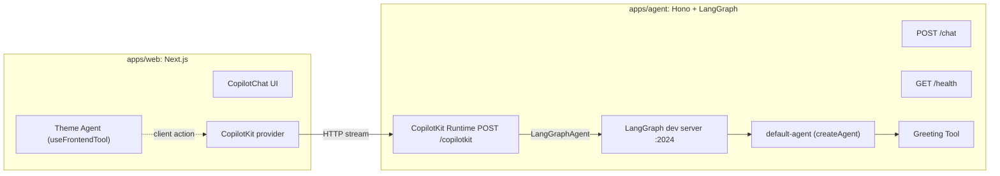

# LangChain + LangGraph + CopilotKit Turborepo Boilerplate

A production-ready **Turborepo** boilerplate for building AI applications with
**LangChain JS**, **LangGraph**, and **CopilotKit**.

- `apps/agent` — LangChain/LangGraph backend that also hosts the CopilotKit
  runtime (`POST /copilotkit`), plus `POST /chat` and `GET /health`.
- `apps/web` — Next.js + CopilotKit + Tailwind + shadcn/ui ChatGPT-style UI.
- `packages/*` — shared config, types, utilities, prompts, and UI.

## Architecture



The agent runs two processes in dev: the LangGraph dev server (`:2024`, from
`langgraph.json`) and the Hono API (`:4000`) that hosts the CopilotKit runtime
and proxies to it. The web app points `runtimeUrl` directly at the agent.

## Tech stack

| Area        | Choice                                                     |
| ----------- | ---------------------------------------------------------- |
| Monorepo    | Turborepo + pnpm workspaces + TypeScript (strict)         |
| Agent       | Node, LangChain, LangGraph, Hono, Zod, CopilotKit runtime |
| Frontend    | Next.js (App Router), React 19, CopilotKit, Tailwind, shadcn/ui |
| Tooling     | Shared ESLint (flat), Prettier, and tsconfig via `@repo/config` |

## Getting started

Requirements: Node >= 20 and pnpm (`corepack enable`).

```bash
# 1. Install dependencies
pnpm install

# 2. Configure environment (one `.env` per app)
cp apps/agent/.env.example apps/agent/.env
cp apps/web/.env.example apps/web/.env
# then set OPENAI_API_KEY in apps/agent/.env and Firebase keys in apps/web/.env

# 3. Run everything (agent LangGraph + agent API + web) in parallel
pnpm dev
```

- Web UI: http://localhost:3000
- Agent API: http://localhost:4000 (`/health`, `/chat`, `/copilotkit`)
- LangGraph dev server: http://localhost:2024

### Useful scripts

```bash
pnpm dev            # run all apps
pnpm dev:agent      # run only the agent (LangGraph + API)
pnpm dev:web        # run only the web app
pnpm typecheck      # type-check every package
pnpm lint           # lint every package
pnpm format         # format with Prettier
```

## Repository layout

```
apps/
  agent/   LangGraph agent + Hono API + CopilotKit runtime
  web/     Next.js + CopilotKit frontend
packages/
  config/  shared tsconfig / eslint / prettier
  types/   shared TypeScript types
  shared/  framework-agnostic constants + utils
  prompts/ reusable system-prompt builders
  ui/      shared shadcn-style components + cn()
```

## Extending the boilerplate

- **Add a tool**: create `apps/agent/src/tools/<name>.tool.ts` and add it to
  `apps/agent/src/tools/index.ts`.
- **Add an agent**: create `apps/agent/src/agents/<name>/graph.ts`, register it
  in `apps/agent/langgraph.json` and `apps/agent/src/graphs/registry.ts`, then
  point a frontend `CopilotChat agentId=...` at it.
- **Add a client action**: create a component using `useFrontendTool` (see
  `apps/web/src/agents/theme-agent.tsx`).

Hooks are in place for MCP, human-in-the-loop (`interrupt()`), auth, vector DBs,
RAG, memory, observability (LangSmith env), and tests.

See [apps/agent/README.md](apps/agent/README.md) and
[apps/web/README.md](apps/web/README.md) for app-specific details.
