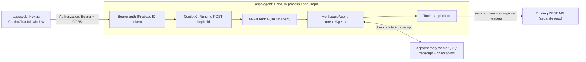

# LangChain + LangGraph Agent Runtime Boilerplate

A **Turborepo** boilerplate for a full-window AI chatbot: a **Next.js**
frontend and a standalone agent service built with **LangChain JS**,
**LangGraph**, and the **CopilotKit runtime** on **Hono**.

Business data lives in your existing REST API (separate repo), which agent
tools call through a typed client.

- `apps/web` — Next.js product frontend: Google sign-in (Firebase) and a
  full-window CopilotKit chat that calls the agent directly from the browser
  (no proxy layer).
- `apps/agent` — Hono service hosting the CopilotKit runtime
  (`POST /copilotkit`) with the LangGraph agent running **in-process**,
  transcript history (`GET /memory/*`), and `GET /health`.
- `apps/memory-worker` — Cloudflare Worker owning all durable state in D1:
  the transcript ledger, semantic recall, and the engine's checkpoints
  (short-term memory).
- `packages/*` — shared config, types, constants, and prompt builders.

## Architecture



The frontend sends the signed-in user's **Firebase ID token** as
`Authorization: Bearer`. The agent verifies it (with revocation checking) and,
when `ALLOWED_EMAIL_DOMAINS` is set, only accepts verified emails on those
domains (e.g. company accounts). The verified identity is injected into each
graph run's config — there is no separate agent server, so the raw credential
never leaves this process. Tools call the existing REST API with a
**service credential** plus acting-user headers — identity always comes from
the verified context, never from model arguments.

## Tech stack

| Area     | Choice                                                                    |
| -------- | ------------------------------------------------------------------------- |
| Monorepo | Turborepo + pnpm workspaces + TypeScript (strict)                         |
| Frontend | Next.js (App Router), React 19, Tailwind CSS 4, CopilotKit v2 CopilotChat |
| Agent    | Node, LangChain, LangGraph, Hono, Zod, CopilotKit runtime                 |
| Identity | Firebase Auth (Google sign-in on web; token verified via firebase-admin)  |
| Tooling  | Shared ESLint (flat) + tsconfig via `@repo/config`; Prettier at repo root |

## Getting started

Requirements: Node >= 20 and pnpm (`corepack enable`).

```bash
# 1. Install dependencies
pnpm install

# 2. Configure environment
cp apps/agent/.env.example apps/agent/.env
# set OPENAI_API_KEY; set FIREBASE_* to enable authenticated endpoints;
# set ALLOWED_EMAIL_DOMAINS to restrict sign-in to your company accounts;
# set API_BASE_URL + API_SERVICE_TOKEN so tools can call your REST API
cp apps/web/.env.example apps/web/.env
# set NEXT_PUBLIC_FIREBASE_* (same Firebase project as the agent)

# 3. Run everything (web + agent)
pnpm dev

# Optional but recommended: durable memory + checkpoints in local D1
pnpm --filter @repo/memory-worker dev
```

- Web app: http://localhost:3000
- Agent API: http://localhost:4000 (`/health`, `/copilotkit`, `/memory`)
- Memory worker (optional): http://localhost:8788 — set `MEMORY_WORKER_URL`
  in `apps/agent/.env`. Without it the agent still chats, but threads reset
  when the process restarts (in-memory checkpoints, no transcript history).

Note: `/copilotkit` and `/memory` require a signed-in Firebase user.
Set `ALLOWED_EMAIL_DOMAINS` to restrict access to your company's accounts.
Without Firebase env vars the endpoints return 503.

### How the frontend connects

`apps/web` signs the user in with the Firebase client SDK and mounts
CopilotKit pointed directly at the agent:

```tsx
<CopilotKit
  runtimeUrl="https://your-agent-host/copilotkit"
  agent="workspaceAgent"
  headers={{ Authorization: `Bearer ${firebaseIdToken}` }}
>
  <CopilotChat agentId="workspaceAgent" />
</CopilotKit>
```

The agent's `CORS_ORIGINS` must include the frontend origin (the default
`.env.example` allows `http://localhost:3000`). Firebase ID tokens expire
after about an hour — `apps/web` subscribes to `onIdTokenChanged` and rotates
the header via `copilotkit.setHeaders()`; see
[apps/web/README.md](apps/web/README.md).

### Useful scripts

```bash
pnpm dev            # run web + agent
pnpm dev:agent      # agent only
pnpm dev:web        # web only
pnpm typecheck      # type-check every package
pnpm lint           # lint every package
pnpm test           # run workspace regression tests
pnpm format         # format with Prettier
```

## Repository layout

```
apps/
  web/           Next.js frontend (Firebase sign-in + full-window CopilotChat)
  agent/         in-process LangGraph agent + Hono API + CopilotKit runtime
  memory-worker/ Cloudflare Worker: D1 transcript ledger + engine checkpoints
packages/
  config/  shared tsconfig / eslint
  types/   shared TypeScript types
  shared/  framework-agnostic constants
  prompts/ reusable system-prompt builders
```

## Dependency notes

`pnpm-workspace.yaml` pins the LangChain stack via `overrides`: a single
`langchain`/`@langchain/core` instance (CopilotKit's `@ag-ui/langgraph`
otherwise pulls a second copy, breaking channel identity checks), and
`@langchain/langgraph` at 1.4.4 (later 1.4.x type definitions reject this
zod release's state fields). `middleware/durable-memory-state.ts` documents the
related runtime workaround — read both comments before upgrading any of
these packages, and re-verify graph construction (`pnpm dev`) after.

## Extending the boilerplate

- **Add a tool over your REST API**: create
  `apps/agent/src/tools/<name>.tool.ts` that wraps
  `apiRequest()` from `services/api-client.ts`, and register it in
  `apps/agent/src/tools/index.ts`. Take the acting identity from the trusted
  agent context (see `middleware/durable-memory.ts` → `wrapToolCall`), never
  from model-provided arguments.
- **Add an agent**: create `apps/agent/src/agents/<name>/graph.ts` plus an
  AG-UI bridge (see `workspace-agent/agui-bridge.ts`), register it in
  `apps/agent/src/graphs/registry.ts` and `config/intelligence.ts`, then
  point the frontend `CopilotChat agentId=...` at it.

See [apps/agent/README.md](apps/agent/README.md) and
[docs/trusted-agent-context.md](docs/trusted-agent-context.md) for details.
