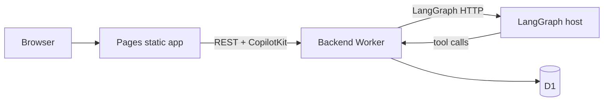

# Deploying to Cloudflare

This practice splits production into three surfaces:

| Component                   | Package         | Cloudflare product             |
| --------------------------- | --------------- | ------------------------------ |
| Backend (REST + CopilotKit) | `apps/backend`  | Worker + D1                    |
| React UI                    | `apps/frontend` | Pages (static)                 |
| LangGraph agent             | `apps/agent`    | **Not** on Workers — see below |

Local development still uses Node (`pnpm dev`). Production uses one backend Worker and Pages for the UI.

## Prerequisites

1. [Cloudflare account](https://dash.cloudflare.com/) with Workers and Pages enabled
2. [Wrangler CLI](https://developers.cloudflare.com/workers/wrangler/) logged in: `npx wrangler login`
3. OpenAI API key (RAG + agent)
4. A **hosted LangGraph deployment** reachable from the public internet (backend calls it server-side)

### LangGraph in production

The agent (`apps/agent`) runs as a LangGraph dev server locally (`langgraph dev`, port 2024). For production, choose one of:

- **[LangGraph Platform](https://langchain-ai.github.io/langgraph/cloud/)** — deploy `userManagementAgent` and copy the deployment URL
- **Self-hosted Node** — run `langgraph up` or your own container behind HTTPS; set `LANGGRAPH_DEPLOYMENT_URL` to that base URL

Workers cannot run the LangGraph Python/Node dev server; the backend Worker proxies browser CopilotKit requests to your hosted graph.

## 1. Database (D1)

The backend worker binds to the same D1 database as the original AI SDK app (`user-management-db`).

```bash
cd langchain-js/practices/user-managements

# Apply migrations to remote D1 (includes default admin seed)
pnpm db:apply:remote
```

Default admin after migration: `admin@admin.com` / `Abcd@123`

Test D1 locally with Wrangler:

```bash
pnpm --filter @repo/backend db:apply:local:cf
pnpm --filter @repo/backend dev:cf
```

## 2. Backend Worker

```bash
cd apps/backend

# Secrets
npx wrangler secret put OPENAI_API_KEY
npx wrangler secret put LANGGRAPH_DEPLOYMENT_URL
# e.g. https://your-langgraph-host.example.com

# Optional: comma-separated browser origins allowed by CORS
npx wrangler secret put CORS_ORIGINS
# e.g. https://user-management-app.pages.dev

pnpm deploy
# e.g. https://user-management-backend.<account>.workers.dev
```

Health check: `GET https://<backend-url>/health`  
CopilotKit endpoint: `https://<backend-url>/api/copilotkit`

## 3. Pages (Vite frontend)

Set build-time URLs in the repo root `.env` (or CI env) **before** building:

```bash
VITE_BACKEND_URL=https://user-management-backend.<account>.workers.dev
VITE_COPILOTKIT_RUNTIME_URL=https://user-management-backend.<account>.workers.dev/api/copilotkit
```

Deploy:

```bash
pnpm deploy:frontend
# Creates/updates Pages project `user-management-app`
```

Ensure `CORS_ORIGINS` on the backend worker includes your Pages URL so session cookies work with `credentials: 'include'`.

## One-shot deploy

From the monorepo root (after secrets and `VITE_*` vars are set):

```bash
pnpm db:apply:remote   # first time only
pnpm deploy            # backend → frontend
```

## Environment reference

| Variable                      | Where                     | Purpose                  |
| ----------------------------- | ------------------------- | ------------------------ |
| `OPENAI_API_KEY`              | Backend Worker secret     | RAG embeddings + search  |
| `LANGGRAPH_DEPLOYMENT_URL`    | Backend Worker secret     | LangGraph HTTP API base  |
| `CORS_ORIGINS`                | Backend Worker secret/var | Browser origins for CORS |
| `VITE_BACKEND_URL`            | Frontend build env        | Backend base URL         |
| `VITE_COPILOTKIT_RUNTIME_URL` | Frontend build env        | CopilotKit runtime URL   |

## Architecture



## Troubleshooting

- **401 on API after login** — check `CORS_ORIGINS` includes the Pages origin; cookies require matching site rules or same-site setup.
- **CopilotKit errors** — verify `LANGGRAPH_DEPLOYMENT_URL` and that the graph id is `userManagementAgent`.
- **RAG 500** — `OPENAI_API_KEY` must be set on the backend worker.
- **D1 empty** — run `pnpm db:apply:remote` and confirm `database_id` in `apps/backend/wrangler.jsonc` matches your Cloudflare D1 instance.
