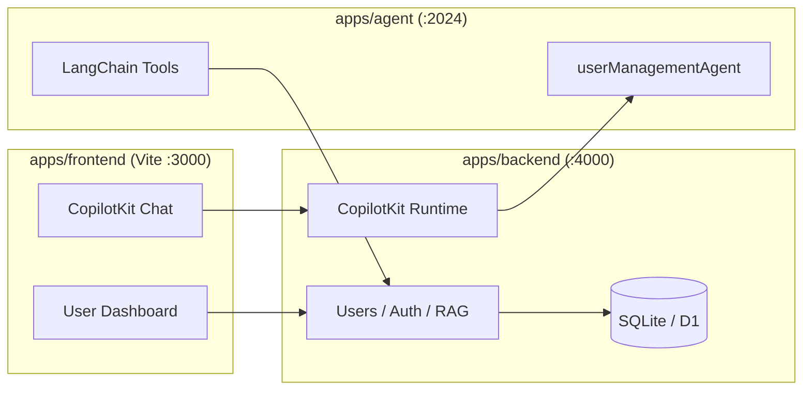

# User Management: AI SDK → LangChain.js / LangGraph

Migration guide from `ai-sdk-training/practices/user-managements` to this LangChain.js practice monorepo, following the **email-agent** layout and `.cursor` conventions.

## Goals

| Area              | AI SDK (current)                        | LangChain.js (target)                                    |
| ----------------- | --------------------------------------- | -------------------------------------------------------- |
| Agent runtime     | Vercel AI `ToolLoopAgent`               | `createAgent` + LangGraph (`langchain` package)          |
| Chat transport    | `@ai-sdk/react` + Next.js `/api/chat`   | CopilotKit v2 + BFF → LangGraph dev server               |
| Human-in-the-loop | `humanAffirmsExecute` two-step in tools | LangGraph `interrupt()` + CopilotKit resume UI           |
| App shell         | Next.js + OpenNext Cloudflare           | Vite + CopilotKit (Phase 1); Cloudflare deploy (Phase 4) |
| Database          | D1 via `@opennextjs/cloudflare`         | SQLite (local dev) via `apps/backend`; D1 for production |
| RAG               | Custom D1 vector tables + AI SDK tools  | Same schema; LangChain `@langchain/core/tools`           |

## Target monorepo layout

Mirrors `practices/email-agent/`:

```
practices/user-managements/
├── .cursor/rules/              # ES6 standards + format-after-edit (from email-agent)
├── .cursor/skills/user-management-practice/
├── apps/
│   ├── agent/                  # LangGraph graph + tools + RAG
│   ├── backend/                # Hono REST + CopilotKit runtime (auth, users, RAG)
│   └── frontend/               # Vite + React + CopilotKit UI
├── migrations/                 # D1/SQLite schema (copied from AI SDK project)
├── MIGRATION.md                # This file
└── package.json                # pnpm workspace root
```

## Architecture



## Migration phases

### Phase 1 — Foundation (this PR)

- [x] Monorepo scaffold + `.cursor` rules
- [x] `apps/agent`: `userManagementAgent` graph with scope guardrail
- [x] Read tools: `get_my_profile`, `list_users`, `find_user_by_email`
- [x] `apps/backend`: Hono REST + CopilotKit runtime, SQLite + auth + user CRUD endpoints
- [x] `apps/frontend`: CopilotKit chat page + dashboard
- [ ] `pnpm install && pnpm dev` smoke test

### Phase 2 — Tool parity

Port remaining AI SDK tools to LangChain `@langchain/core/tools`:

| AI SDK tool         | LangChain tool       | Notes                           |
| ------------------- | -------------------- | ------------------------------- |
| `getMyProfile`      | `get_my_profile`     | Done (Phase 1)                  |
| `updateMyProfile`   | `update_my_profile`  | Use `interrupt()` for preview   |
| `listUsers`         | `list_users`         | Done (Phase 1)                  |
| `getUser`           | `get_user`           |                                 |
| `findUserByEmail`   | `find_user_by_email` | Done (Phase 1)                  |
| `createUser`        | `create_user`        | interrupt + duplicate-name gate |
| `updateUser`        | `update_user`        | interrupt + duplicate-name gate |
| `deleteUser`        | `delete_user`        | interrupt                       |
| `getKnowledge`      | `get_knowledge`      | Port RAG embedding layer        |
| `queryUserInfoTool` | `query_user_info`    | Admin only                      |
| `addKnowledge`      | `add_knowledge`      | Admin only                      |

**Human-in-the-loop redesign**

Replace `humanAffirmsExecute` with LangGraph interrupts (same pattern as email-agent warranty review):

1. Mutating tool builds a preview payload.
2. Tool calls `interrupt({ action, preview, ... })`.
3. UI renders `UserMutationReviewInterrupt` (CopilotKit `useLangGraphInterrupt`).
4. User approves → tool resumes and executes mutation.

Port shared logic unchanged:

- `lib/assistant/user-update-preview.ts`
- `lib/user/profile-patch.ts`
- `lib/directory/display-name-match.ts`
- `lib/schemas/user-management-schemas.ts`

### Phase 3 — UI parity ✅

| Component                        | Target                                        | Status |
| -------------------------------- | --------------------------------------------- | ------ |
| Tool result cards                | `apps/frontend/src/components/tool-display/*` | Done   |
| Custom assistant message         | `UserManagementAssistantMessage`              | Done   |
| Dashboard (user table / profile) | `DashboardPage` + `UserDirectory`             | Done   |
| Thread sidebar                   | `ChatSidebar` + `ThreadHistory`               | Done   |
| App navigation                   | Dashboard ↔ Assistant                         | Done   |

Remaining (optional polish):

- Full admin CRUD forms on dashboard (currently read-only + assistant mutations)
- CopilotKit Intelligence for cloud-persisted threads (`npx copilotkit@latest project select`)

### Phase 4 — Production / Cloudflare ✅

- `apps/backend` — Cloudflare Worker + D1 (`src/worker.ts`, `wrangler.jsonc`); shared Hono app via `createApp()` with SQLite (local) or D1 (prod) store adapters; CopilotKit routes in the same Worker.
- `apps/frontend` — Vite build deployed to Cloudflare Pages; `VITE_BACKEND_URL` and `VITE_COPILOTKIT_RUNTIME_URL` at build time.
- LangGraph agent — host on LangGraph Platform or self-hosted Node (documented in `DEPLOY.md`); not deployed to Workers.
- Scripts: `pnpm db:apply:remote`, `pnpm deploy:backend|frontend`, `pnpm deploy`.

## Code mapping (AI SDK → LangChain)

| AI SDK source                                        | LangChain target                                          |
| ---------------------------------------------------- | --------------------------------------------------------- |
| `src/server/ai/agents/user-management-agent.ts`      | `apps/agent/src/user-management-agent/graph.ts`           |
| `src/server/ai/tools/user-management-agent-tools.ts` | `apps/agent/src/user-management-agent/tools/*.ts`         |
| `src/server/ai/tools/rag-tools.ts`                   | `apps/agent/src/user-management-agent/tools/rag-tools.ts` |
| `src/server/ai/utils/chat-post.ts`                   | Removed — CopilotKit + guardrail middleware               |
| `src/server/constants/promts.ts`                     | `apps/agent/src/constants/prompts.ts`                     |
| `src/server/users/repository.ts`                     | `apps/backend/src/users/repository.ts`                    |
| `src/app/api/**`                                     | `apps/backend/src/app/create-app.ts`                      |
| `src/hooks/use-assistant-*`                          | `apps/frontend/src/hooks/use-*` (CopilotKit)              |

## Conventions (from email-agent `.cursor` rules)

- Single quotes, ES6 arrow functions, grouped imports with comments.
- JSDoc on every exported function.
- Model via `getChatModel()` — never construct `ChatOpenAI` directly.
- `.js` extensions on relative imports in `apps/agent` (ESM).
- Format every edited file before finishing (`pnpm run format` or Prettier).

## Local development

```bash
cd langchain-js/practices/user-managements
cp .env.example .env   # OPENAI_API_KEY=sk-...
pnpm install
pnpm db:apply:local    # apply SQLite migrations
pnpm dev               # agent :2024, backend :4000, frontend :3000
```

Default admin: `admin@admin.com` / `Abcd@123`

## Rollback strategy

Keep `ai-sdk-training/practices/user-managements` unchanged until Phase 3 UI parity is verified. This practice is a parallel implementation, not an in-place rewrite.
